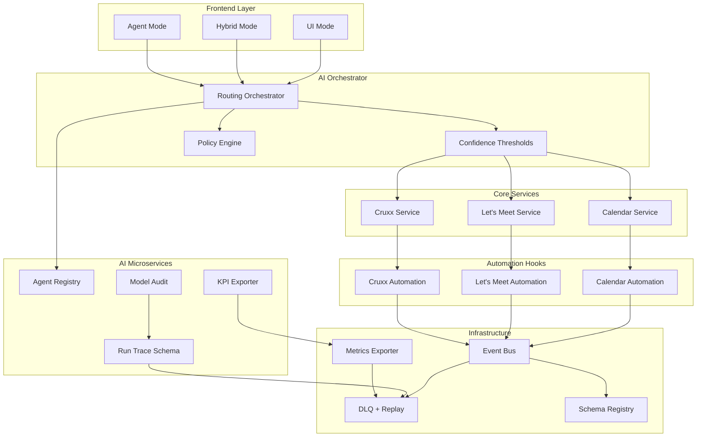
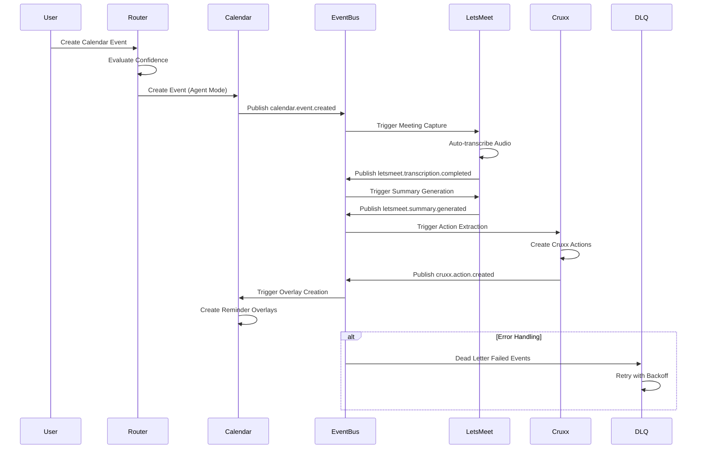
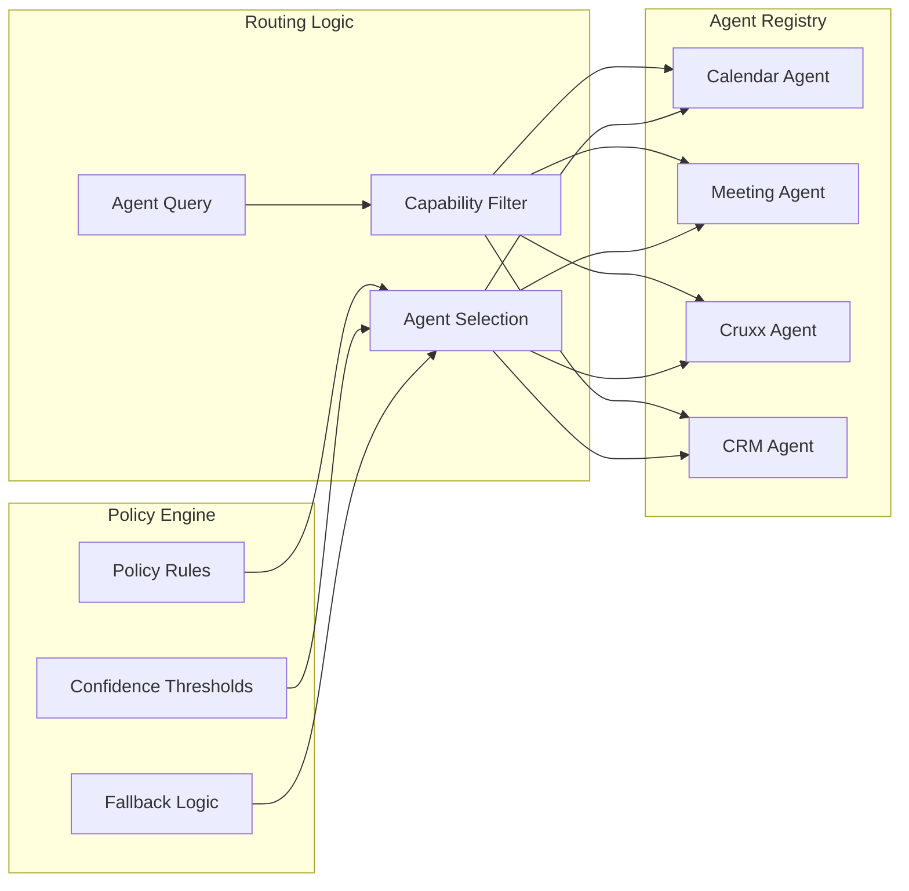
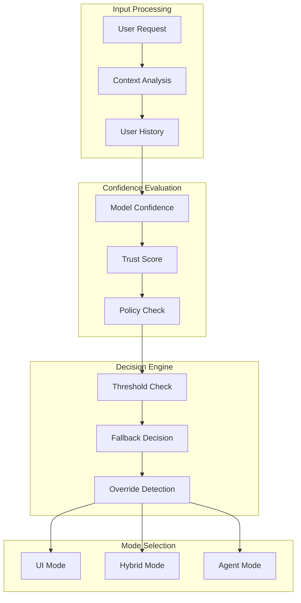
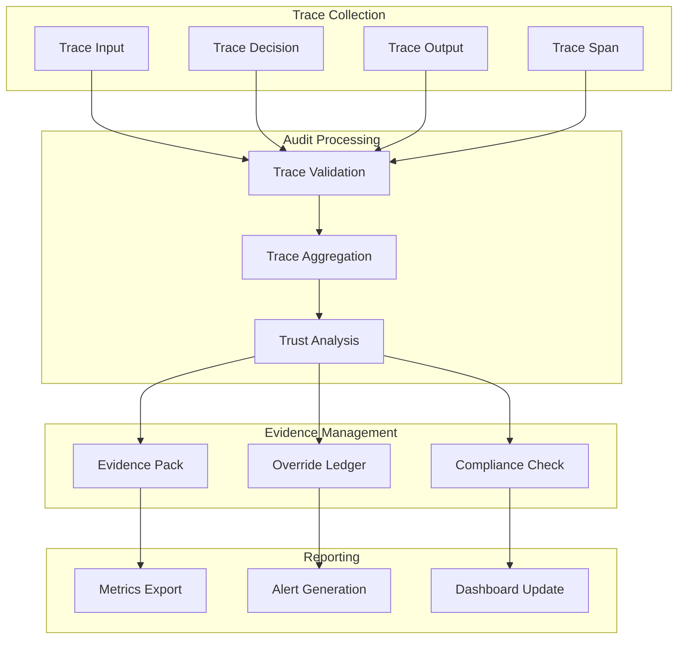
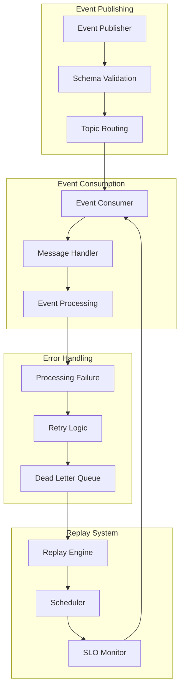
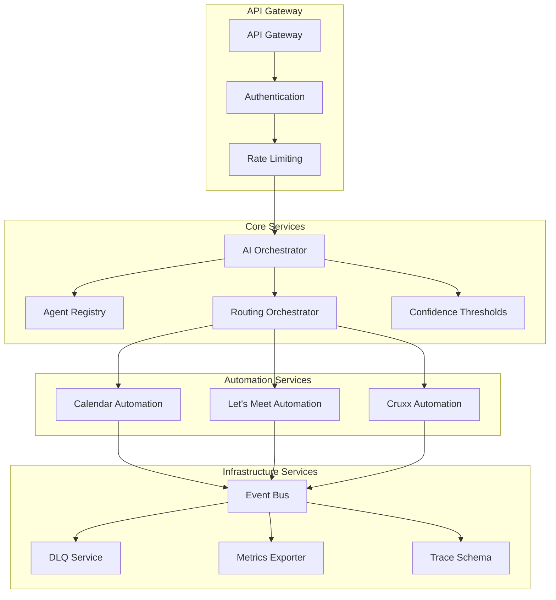
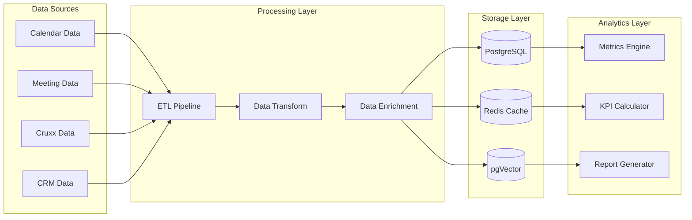
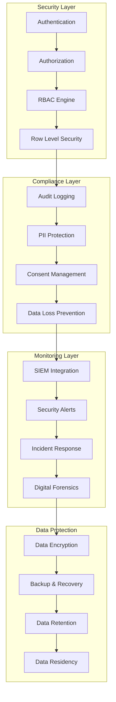
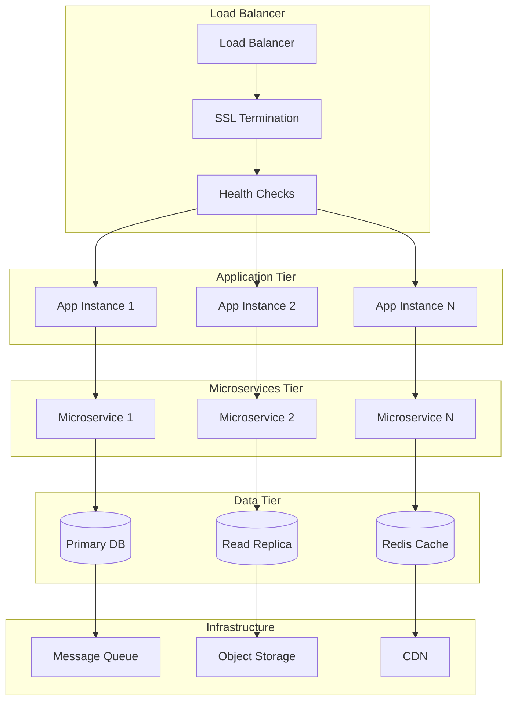

# Automation Layer Architecture Diagrams

This document contains the architecture diagrams for the RevAI Pro automation layer.

## 1. Overall Automation Architecture

## 2. Event-Driven Automation Flow

## 3. Agent Registry and Routing

## 4. Trust and Confidence Management

## 5. Run Trace and Audit Flow

## 6. DLQ and Replay Architecture

## 7. Microservices Communication

## 8. Data Flow Architecture

## 9. Security and Compliance Architecture

## 10. Deployment Architecture

---

## Diagram Usage

These diagrams should be embedded in the relevant documentation chapters:

- **Chapter 2.1**: Overall Automation Architecture
- **Chapter 2.2**: Event-Driven Automation Flow
- **Chapter 2.3**: Agent Registry and Routing
- **Chapter 2.4**: Trust and Confidence Management
- **Chapter 2.5**: Run Trace and Audit Flow
- **Chapter 2.6**: DLQ and Replay Architecture
- **Chapter 2.7**: Microservices Communication
- **Chapter 2.8**: Data Flow Architecture
- **Chapter 2.9**: Security and Compliance Architecture
- **Chapter 2.10**: Deployment Architecture

Each diagram provides a visual representation of the system components and their interactions, making it easier to understand the complex automation layer architecture.
