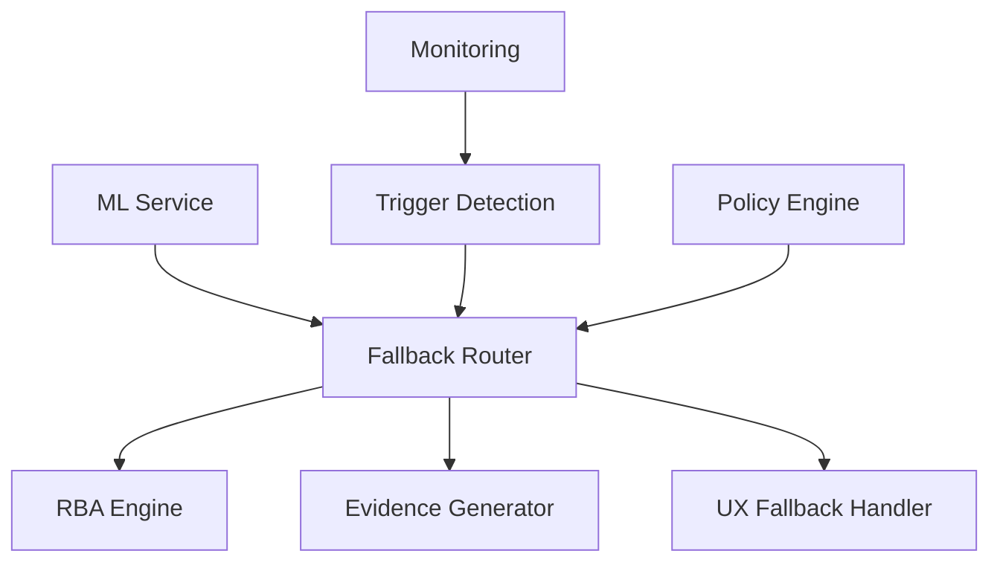

# Developer Guide for Fallback Design - Task 6.4.78

## Table of Contents
1. [Overview](#overview)
2. [Fallback Architecture](#fallback-architecture)
3. [Implementation Patterns](#implementation-patterns)
4. [Best Practices](#best-practices)
5. [Code Examples](#code-examples)
6. [Testing Guidelines](#testing-guidelines)
7. [Monitoring and Observability](#monitoring-and-observability)
8. [Troubleshooting](#troubleshooting)

## Overview

This guide provides developers with comprehensive instructions for designing, implementing, and maintaining fallback mechanisms in the RBIA (Rule-Based Intelligence Architecture) system. Fallback systems ensure graceful degradation from ML to deterministic RBA when issues occur.

### Key Principles

1. **Evidence-First**: Every fallback decision must be logged with evidence
2. **Graceful Degradation**: System should degrade functionality, not fail completely
3. **Deterministic Fallback**: RBA fallbacks must be predictable and auditable
4. **Tenant Isolation**: Fallbacks must not affect other tenants
5. **Performance Aware**: Fallback should not significantly impact performance

## Fallback Architecture

### System Components



### Core Services

1. **Fallback Routing Service** (`api/fallback_routing_service.py`)
   - Central orchestrator for fallback decisions
   - Evaluates triggers and routes to appropriate fallback

2. **UX Fallback Flows Service** (`api/ux_fallback_flows_service.py`)
   - Manages user experience during fallbacks
   - Provides persona-aware messaging

3. **Evidence Pack Generator** (`dsl/intelligence/evidence_pack_generator.py`)
   - Creates tamper-evident audit trails
   - Supports compliance requirements

## Implementation Patterns

### 1. Trigger-Based Fallback Pattern

Use this pattern when you need to respond to specific system events or conditions.

```python
from api.fallback_routing_service import FallbackTrigger
from enum import Enum

class CustomTrigger(str, Enum):
    CUSTOM_ML_FAILURE = "custom_ml_failure"
    CUSTOM_TIMEOUT = "custom_timeout"

async def handle_custom_failure(error_context: dict):
    """Handle custom failure scenario"""
    
    # Create fallback request
    fallback_request = {
        "request_id": f"custom_{uuid.uuid4()}",
        "tenant_id": error_context["tenant_id"],
        "workflow_id": error_context["workflow_id"],
        "current_system": "ml",
        "error_type": "custom_ml_failure",
        "error_message": error_context["error_message"],
        "confidence_score": error_context.get("confidence", 0.0),
        "timestamp": datetime.utcnow().isoformat()
    }
    
    # Trigger fallback evaluation
    routing_service = FallbackRoutingService()
    result = await routing_service.evaluate_fallback_request(fallback_request)
    
    if result["should_fallback"]:
        # Execute fallback logic
        return await execute_fallback_logic(result)
    else:
        # Continue with normal processing
        return await continue_normal_processing(error_context)
```

### 2. Circuit Breaker Pattern

Implement circuit breakers to prevent cascading failures.

```python
from datetime import datetime, timedelta
from typing import Optional

class CircuitBreaker:
    """Circuit breaker for fallback systems"""
    
    def __init__(self, failure_threshold: int = 5, recovery_timeout: int = 60):
        self.failure_threshold = failure_threshold
        self.recovery_timeout = recovery_timeout
        self.failure_count = 0
        self.last_failure_time: Optional[datetime] = None
        self.state = "CLOSED"  # CLOSED, OPEN, HALF_OPEN
    
    async def call(self, func, *args, **kwargs):
        """Execute function with circuit breaker protection"""
        
        if self.state == "OPEN":
            if self._should_attempt_reset():
                self.state = "HALF_OPEN"
            else:
                raise CircuitBreakerOpenError("Circuit breaker is OPEN")
        
        try:
            result = await func(*args, **kwargs)
            self._on_success()
            return result
        except Exception as e:
            self._on_failure()
            raise
    
    def _should_attempt_reset(self) -> bool:
        """Check if circuit breaker should attempt reset"""
        if self.last_failure_time is None:
            return True
        
        return (datetime.utcnow() - self.last_failure_time).seconds > self.recovery_timeout
    
    def _on_success(self):
        """Handle successful call"""
        self.failure_count = 0
        self.state = "CLOSED"
    
    def _on_failure(self):
        """Handle failed call"""
        self.failure_count += 1
        self.last_failure_time = datetime.utcnow()
        
        if self.failure_count >= self.failure_threshold:
            self.state = "OPEN"

# Usage example
circuit_breaker = CircuitBreaker(failure_threshold=3, recovery_timeout=30)

async def protected_ml_call(model_input):
    """ML call protected by circuit breaker"""
    return await circuit_breaker.call(ml_service.predict, model_input)
```

### 3. Graceful Degradation Pattern

Implement gradual feature reduction instead of complete failure.

```python
from dataclasses import dataclass
from typing import List, Any

@dataclass
class DegradationLevel:
    level: int
    features_available: List[str]
    performance_impact: str
    user_message: str

class GracefulDegradationHandler:
    """Handle graceful degradation of features"""
    
    def __init__(self):
        self.degradation_levels = {
            0: DegradationLevel(
                level=0,
                features_available=["full_ml", "explainability", "real_time"],
                performance_impact="none",
                user_message="All features available"
            ),
            1: DegradationLevel(
                level=1, 
                features_available=["cached_ml", "basic_explainability"],
                performance_impact="slight",
                user_message="Using cached predictions for better performance"
            ),
            2: DegradationLevel(
                level=2,
                features_available=["rba_rules", "simple_explanation"],
                performance_impact="moderate", 
                user_message="Using rule-based system for reliability"
            ),
            3: DegradationLevel(
                level=3,
                features_available=["manual_override"],
                performance_impact="high",
                user_message="Manual review required"
            )
        }
        self.current_level = 0
    
    async def evaluate_degradation_need(self, system_health: dict) -> int:
        """Evaluate what degradation level is needed"""
        
        if system_health["ml_availability"] < 0.5:
            return 3  # Manual override only
        elif system_health["ml_availability"] < 0.8:
            return 2  # RBA rules
        elif system_health["cache_hit_rate"] < 0.6:
            return 1  # Cached ML
        else:
            return 0  # Full features
    
    async def apply_degradation(self, target_level: int, context: dict):
        """Apply degradation to specified level"""
        
        if target_level == self.current_level:
            return  # No change needed
        
        degradation = self.degradation_levels[target_level]
        
        # Log degradation change
        logger.warning(f"Applying degradation level {target_level}: {degradation.user_message}")
        
        # Update system configuration
        await self._update_feature_flags(degradation.features_available)
        
        # Generate user notification
        await self._notify_users(degradation.user_message, context)
        
        self.current_level = target_level
    
    async def _update_feature_flags(self, available_features: List[str]):
        """Update feature flags based on available features"""
        feature_flags = {
            "ml_enabled": "full_ml" in available_features or "cached_ml" in available_features,
            "explainability_enabled": "explainability" in available_features or "basic_explainability" in available_features,
            "real_time_enabled": "real_time" in available_features,
            "rba_enabled": "rba_rules" in available_features,
            "manual_mode": "manual_override" in available_features
        }
        
        # Update feature flags in system
        logger.info(f"Updated feature flags: {feature_flags}")
    
    async def _notify_users(self, message: str, context: dict):
        """Notify users about degradation"""
        # Implementation would integrate with UX fallback service
        logger.info(f"User notification: {message}")
```

## Best Practices

### 1. Fallback Coverage

Ensure every ML node has at least one fallback option:

```python
def validate_fallback_coverage(ir_graph: dict) -> List[str]:
    """Validate that all ML nodes have fallback coverage"""
    
    issues = []
    
    for node_id, node in ir_graph.get("nodes", {}).items():
        if node.get("type") == "ml_node":
            fallback_options = node.get("fallback", [])
            
            if not fallback_options:
                issues.append(f"ML node {node_id} has no fallback options")
            elif len(fallback_options) == 1 and fallback_options[0].get("type") == "manual":
                issues.append(f"ML node {node_id} only has manual fallback (consider adding RBA)")
    
    return issues
```

### 2. Evidence Generation

Always generate evidence for fallback decisions:

```python
async def trigger_fallback_with_evidence(
    trigger_type: str,
    context: dict,
    tenant_id: int
):
    """Trigger fallback and generate evidence"""
    
    # Generate evidence pack
    evidence_generator = EvidencePackGenerator()
    evidence_data = {
        "trigger_type": trigger_type,
        "trigger_context": context,
        "timestamp": datetime.utcnow().isoformat(),
        "system_state": await get_system_state()
    }
    
    evidence_id = await evidence_generator.generate_evidence_pack(
        evidence_type=EvidenceType.FALLBACK_DECISION,
        tenant_id=tenant_id,
        industry_code=context.get("industry_code", "GENERAL"),
        tenant_tier=context.get("tenant_tier", "bronze"),
        evidence_data=evidence_data,
        created_by="system"
    )
    
    # Trigger fallback
    fallback_result = await execute_fallback(trigger_type, context)
    
    # Link evidence to fallback result
    fallback_result["evidence_pack_id"] = evidence_id
    
    return fallback_result
```

### 3. Tenant Isolation

Ensure fallbacks don't affect other tenants:

```python
class TenantIsolatedFallback:
    """Fallback handler with tenant isolation"""
    
    def __init__(self):
        self.tenant_states = {}
        self.tenant_locks = {}
    
    async def trigger_tenant_fallback(self, tenant_id: str, trigger_data: dict):
        """Trigger fallback for specific tenant only"""
        
        # Acquire tenant-specific lock
        if tenant_id not in self.tenant_locks:
            self.tenant_locks[tenant_id] = asyncio.Lock()
        
        async with self.tenant_locks[tenant_id]:
            # Update tenant state
            if tenant_id not in self.tenant_states:
                self.tenant_states[tenant_id] = {"fallback_active": False, "fallback_count": 0}
            
            tenant_state = self.tenant_states[tenant_id]
            tenant_state["fallback_active"] = True
            tenant_state["fallback_count"] += 1
            tenant_state["last_fallback"] = datetime.utcnow().isoformat()
            
            # Execute tenant-specific fallback
            result = await self._execute_isolated_fallback(tenant_id, trigger_data)
            
            # Log for audit
            logger.info(f"Tenant {tenant_id} fallback executed: {result}")
            
            return result
    
    async def _execute_isolated_fallback(self, tenant_id: str, trigger_data: dict):
        """Execute fallback isolated to specific tenant"""
        
        # Tenant-specific fallback logic
        return {
            "tenant_id": tenant_id,
            "fallback_executed": True,
            "isolation_verified": True,
            "timestamp": datetime.utcnow().isoformat()
        }
```

## Code Examples

### Complete Fallback Implementation

```python
from typing import Dict, Any, Optional
import asyncio
import logging
from datetime import datetime
import uuid

class CompleteFallbackHandler:
    """Complete fallback handler example"""
    
    def __init__(self):
        self.logger = logging.getLogger(__name__)
        self.circuit_breaker = CircuitBreaker()
        self.degradation_handler = GracefulDegradationHandler()
        self.evidence_generator = EvidencePackGenerator()
    
    async def handle_ml_request(
        self,
        request_data: Dict[str, Any],
        tenant_id: str,
        workflow_id: str
    ) -> Dict[str, Any]:
        """Handle ML request with comprehensive fallback"""
        
        try:
            # Try ML service with circuit breaker protection
            ml_result = await self.circuit_breaker.call(
                self._call_ml_service,
                request_data
            )
            
            # Validate ML result quality
            if not self._validate_ml_result(ml_result):
                raise MLQualityError("ML result quality below threshold")
            
            return {
                "result": ml_result,
                "source": "ml",
                "fallback_triggered": False
            }
            
        except (CircuitBreakerOpenError, MLQualityError, Exception) as e:
            self.logger.warning(f"ML service failed: {e}, triggering fallback")
            
            # Generate evidence for the failure
            evidence_id = await self._generate_failure_evidence(
                str(e), request_data, tenant_id, workflow_id
            )
            
            # Execute fallback
            fallback_result = await self._execute_comprehensive_fallback(
                request_data, tenant_id, workflow_id, str(e)
            )
            
            fallback_result["evidence_pack_id"] = evidence_id
            return fallback_result
    
    async def _call_ml_service(self, request_data: Dict[str, Any]) -> Dict[str, Any]:
        """Call ML service"""
        # Simulate ML service call
        await asyncio.sleep(0.1)
        
        # Simulate occasional failures for testing
        import random
        if random.random() < 0.1:  # 10% failure rate
            raise Exception("ML service timeout")
        
        return {"prediction": 0.85, "confidence": 0.92}
    
    def _validate_ml_result(self, result: Dict[str, Any]) -> bool:
        """Validate ML result quality"""
        confidence = result.get("confidence", 0)
        return confidence > 0.7
    
    async def _generate_failure_evidence(
        self,
        error_message: str,
        request_data: Dict[str, Any],
        tenant_id: str,
        workflow_id: str
    ) -> str:
        """Generate evidence pack for failure"""
        
        evidence_data = {
            "failure_type": "ml_service_failure",
            "error_message": error_message,
            "request_data": request_data,
            "workflow_id": workflow_id,
            "timestamp": datetime.utcnow().isoformat(),
            "system_health": await self._get_system_health()
        }
        
        return await self.evidence_generator.generate_evidence_pack(
            evidence_type=EvidenceType.SYSTEM_FAILURE,
            tenant_id=int(tenant_id) if tenant_id.isdigit() else 1,
            industry_code="GENERAL",
            tenant_tier="bronze", 
            evidence_data=evidence_data,
            created_by="fallback_system"
        )
    
    async def _execute_comprehensive_fallback(
        self,
        request_data: Dict[str, Any],
        tenant_id: str,
        workflow_id: str,
        error_message: str
    ) -> Dict[str, Any]:
        """Execute comprehensive fallback strategy"""
        
        # Try RBA fallback first
        try:
            rba_result = await self._try_rba_fallback(request_data)
            return {
                "result": rba_result,
                "source": "rba",
                "fallback_triggered": True,
                "fallback_reason": error_message
            }
        except Exception as rba_error:
            self.logger.warning(f"RBA fallback failed: {rba_error}")
        
        # Try cached result fallback
        try:
            cached_result = await self._try_cached_fallback(request_data)
            return {
                "result": cached_result,
                "source": "cache",
                "fallback_triggered": True,
                "fallback_reason": error_message
            }
        except Exception as cache_error:
            self.logger.warning(f"Cache fallback failed: {cache_error}")
        
        # Final fallback: safe default
        return {
            "result": self._get_safe_default(request_data),
            "source": "default",
            "fallback_triggered": True,
            "fallback_reason": error_message,
            "requires_manual_review": True
        }
    
    async def _try_rba_fallback(self, request_data: Dict[str, Any]) -> Dict[str, Any]:
        """Try rule-based fallback"""
        # Simulate RBA processing
        await asyncio.sleep(0.05)
        return {"prediction": 0.75, "confidence": 1.0, "rule_applied": "default_approval"}
    
    async def _try_cached_fallback(self, request_data: Dict[str, Any]) -> Dict[str, Any]:
        """Try cached result fallback"""
        # Simulate cache lookup
        await asyncio.sleep(0.01)
        return {"prediction": 0.80, "confidence": 0.85, "cached": True}
    
    def _get_safe_default(self, request_data: Dict[str, Any]) -> Dict[str, Any]:
        """Get safe default result"""
        return {
            "prediction": 0.5,  # Neutral prediction
            "confidence": 0.0,
            "default_applied": True,
            "manual_review_required": True
        }
    
    async def _get_system_health(self) -> Dict[str, Any]:
        """Get current system health metrics"""
        return {
            "ml_service_availability": 0.95,
            "rba_service_availability": 0.99,
            "cache_hit_rate": 0.85,
            "average_response_time": 150
        }

# Usage example
async def main():
    handler = CompleteFallbackHandler()
    
    result = await handler.handle_ml_request(
        request_data={"customer_id": "12345", "amount": 1000},
        tenant_id="tenant_1",
        workflow_id="loan_approval"
    )
    
    print(f"Result: {result}")

if __name__ == "__main__":
    asyncio.run(main())
```

## Testing Guidelines

### Unit Tests

```python
import pytest
from unittest.mock import Mock, patch, AsyncMock

class TestFallbackHandler:
    
    @pytest.fixture
    def fallback_handler(self):
        return CompleteFallbackHandler()
    
    @pytest.mark.asyncio
    async def test_successful_ml_request(self, fallback_handler):
        """Test successful ML request without fallback"""
        
        with patch.object(fallback_handler, '_call_ml_service') as mock_ml:
            mock_ml.return_value = {"prediction": 0.85, "confidence": 0.92}
            
            result = await fallback_handler.handle_ml_request(
                {"test": "data"}, "tenant_1", "workflow_1"
            )
            
            assert result["source"] == "ml"
            assert result["fallback_triggered"] is False
    
    @pytest.mark.asyncio
    async def test_ml_failure_triggers_rba_fallback(self, fallback_handler):
        """Test ML failure triggers RBA fallback"""
        
        with patch.object(fallback_handler, '_call_ml_service') as mock_ml:
            with patch.object(fallback_handler, '_try_rba_fallback') as mock_rba:
                mock_ml.side_effect = Exception("ML service down")
                mock_rba.return_value = {"prediction": 0.75, "confidence": 1.0}
                
                result = await fallback_handler.handle_ml_request(
                    {"test": "data"}, "tenant_1", "workflow_1"
                )
                
                assert result["source"] == "rba"
                assert result["fallback_triggered"] is True
    
    @pytest.mark.asyncio
    async def test_complete_fallback_chain(self, fallback_handler):
        """Test complete fallback chain to safe default"""
        
        with patch.object(fallback_handler, '_call_ml_service') as mock_ml:
            with patch.object(fallback_handler, '_try_rba_fallback') as mock_rba:
                with patch.object(fallback_handler, '_try_cached_fallback') as mock_cache:
                    mock_ml.side_effect = Exception("ML service down")
                    mock_rba.side_effect = Exception("RBA service down")
                    mock_cache.side_effect = Exception("Cache miss")
                    
                    result = await fallback_handler.handle_ml_request(
                        {"test": "data"}, "tenant_1", "workflow_1"
                    )
                    
                    assert result["source"] == "default"
                    assert result["requires_manual_review"] is True
```

### Integration Tests

```python
@pytest.mark.integration
class TestFallbackIntegration:
    
    @pytest.mark.asyncio
    async def test_end_to_end_fallback_flow(self):
        """Test complete end-to-end fallback flow"""
        
        # Setup test environment
        test_data = {
            "customer_id": "test_customer",
            "loan_amount": 50000,
            "credit_score": 720
        }
        
        # Test with real services (mocked external dependencies)
        handler = CompleteFallbackHandler()
        
        # Simulate ML service failure
        with patch('ml_service.predict', side_effect=Exception("Service unavailable")):
            result = await handler.handle_ml_request(
                test_data, "test_tenant", "loan_approval"
            )
        
        # Verify fallback was triggered and evidence was generated
        assert result["fallback_triggered"] is True
        assert "evidence_pack_id" in result
        assert result["source"] in ["rba", "cache", "default"]
```

## Monitoring and Observability

### Key Metrics

1. **Fallback Rate**: Percentage of requests that trigger fallback
2. **Fallback Success Rate**: Percentage of successful fallback executions
3. **Recovery Time**: Time to recover from fallback to normal operation
4. **Evidence Generation Rate**: Percentage of fallbacks with evidence packs

### Logging

```python
import logging
import json
from datetime import datetime

class FallbackLogger:
    """Structured logging for fallback events"""
    
    def __init__(self):
        self.logger = logging.getLogger("fallback_system")
    
    def log_fallback_triggered(
        self,
        trigger_type: str,
        tenant_id: str,
        workflow_id: str,
        context: dict
    ):
        """Log fallback trigger event"""
        
        log_data = {
            "event": "fallback_triggered",
            "timestamp": datetime.utcnow().isoformat(),
            "trigger_type": trigger_type,
            "tenant_id": tenant_id,
            "workflow_id": workflow_id,
            "context": context
        }
        
        self.logger.warning(json.dumps(log_data))
    
    def log_fallback_success(
        self,
        fallback_source: str,
        tenant_id: str,
        response_time_ms: float
    ):
        """Log successful fallback execution"""
        
        log_data = {
            "event": "fallback_success",
            "timestamp": datetime.utcnow().isoformat(),
            "fallback_source": fallback_source,
            "tenant_id": tenant_id,
            "response_time_ms": response_time_ms
        }
        
        self.logger.info(json.dumps(log_data))
```

### Metrics Collection

```python
from prometheus_client import Counter, Histogram, Gauge

# Prometheus metrics
fallback_triggered_total = Counter(
    'fallback_triggered_total',
    'Total number of fallback triggers',
    ['trigger_type', 'tenant_id']
)

fallback_response_time = Histogram(
    'fallback_response_time_seconds',
    'Fallback response time in seconds',
    ['fallback_source']
)

active_fallbacks = Gauge(
    'active_fallbacks_total',
    'Number of currently active fallbacks',
    ['tenant_id']
)
```

## Troubleshooting

### Common Issues

1. **High Fallback Rate**
   - Check ML service health
   - Review confidence thresholds
   - Analyze request patterns

2. **Fallback Failures**
   - Verify RBA service availability
   - Check cache performance
   - Review safe default logic

3. **Evidence Generation Issues**
   - Check database connectivity
   - Verify storage permissions
   - Review evidence pack size limits

### Debug Tools

```python
class FallbackDebugger:
    """Debug tools for fallback system"""
    
    async def diagnose_fallback_issue(self, tenant_id: str, workflow_id: str):
        """Diagnose fallback issues for specific tenant/workflow"""
        
        diagnosis = {
            "tenant_id": tenant_id,
            "workflow_id": workflow_id,
            "timestamp": datetime.utcnow().isoformat()
        }
        
        # Check system health
        diagnosis["system_health"] = await self._check_system_health()
        
        # Check recent fallbacks
        diagnosis["recent_fallbacks"] = await self._get_recent_fallbacks(tenant_id)
        
        # Check configuration
        diagnosis["configuration"] = await self._check_configuration(tenant_id, workflow_id)
        
        return diagnosis
    
    async def _check_system_health(self):
        """Check overall system health"""
        return {
            "ml_service": await self._ping_service("ml_service"),
            "rba_service": await self._ping_service("rba_service"),
            "cache_service": await self._ping_service("cache_service"),
            "evidence_service": await self._ping_service("evidence_service")
        }
    
    async def _ping_service(self, service_name: str) -> dict:
        """Ping a service to check health"""
        try:
            # Implementation would ping actual service
            return {"status": "healthy", "response_time_ms": 50}
        except Exception as e:
            return {"status": "unhealthy", "error": str(e)}
```

---

## Conclusion

This developer guide provides the foundation for implementing robust fallback systems in RBIA. Remember to:

1. Always implement evidence generation
2. Ensure tenant isolation
3. Test fallback paths thoroughly
4. Monitor fallback performance
5. Plan for graceful degradation

For additional support, refer to the operational playbooks and contact the platform engineering team.

---

**Version**: 1.0  
**Last Updated**: 2024-01-15  
**Authors**: RBIA Platform Engineering Team
